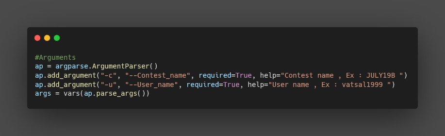
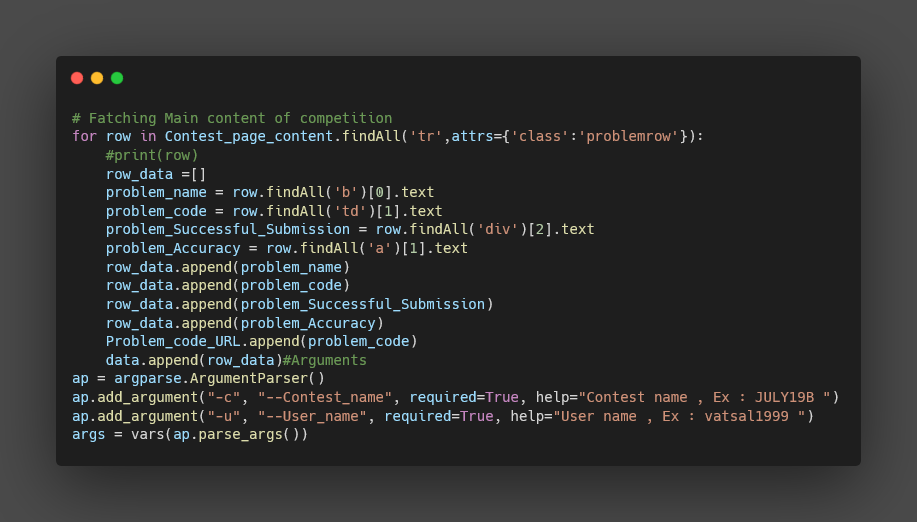
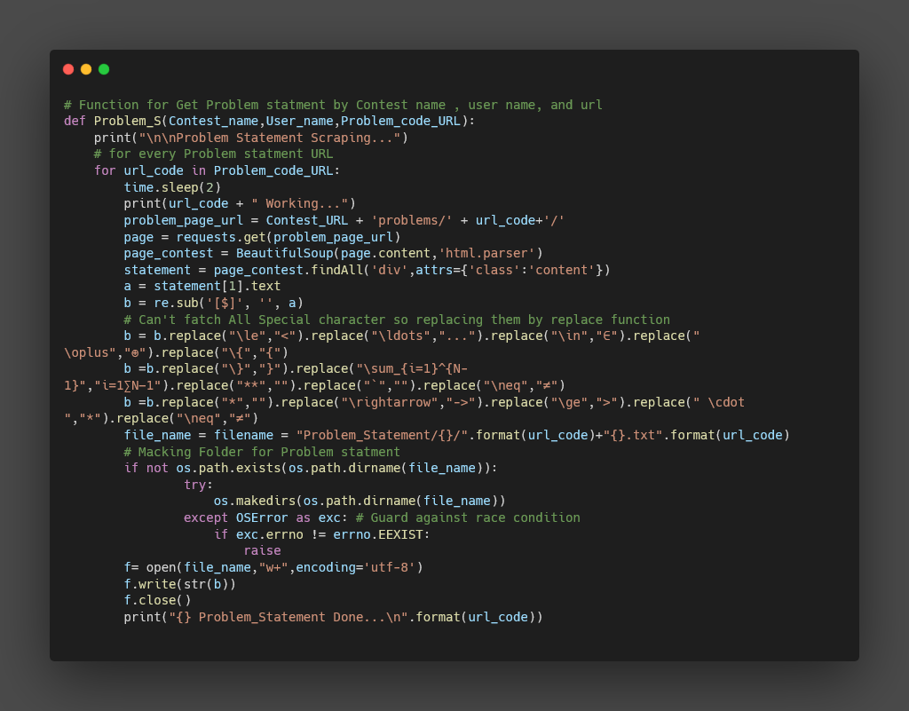
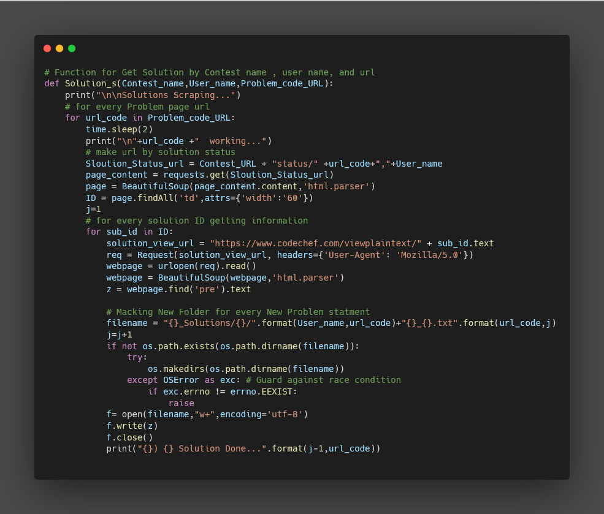
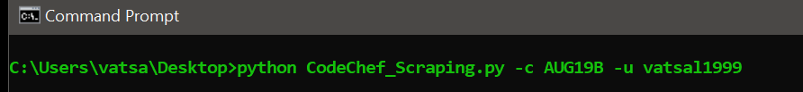
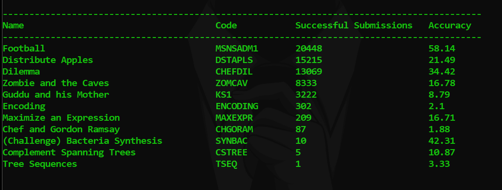
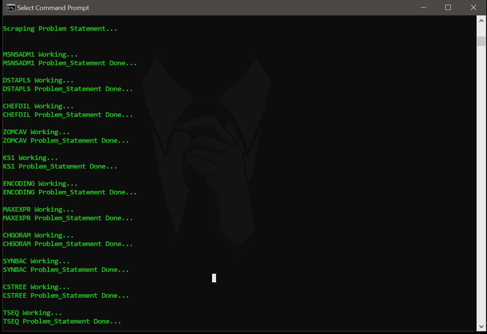
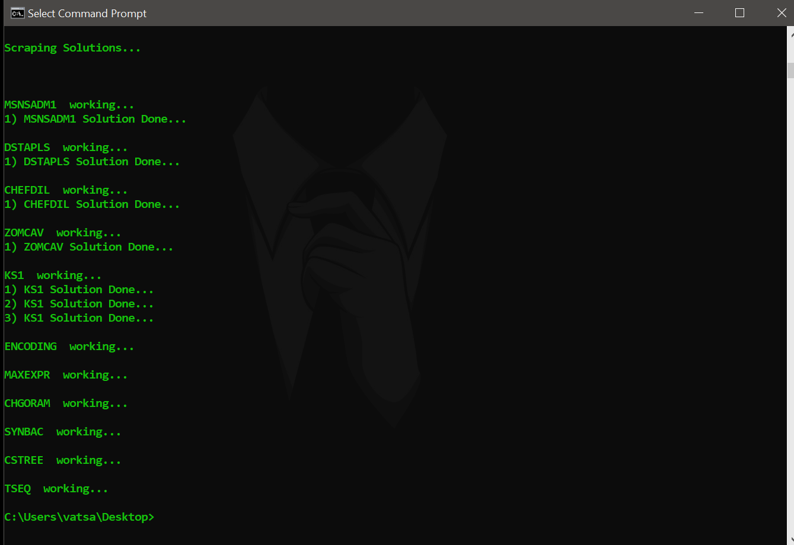

# Codechef_Scraping

Python Script to get All Problem Statements and Solutions of any user for Any CodeChef Competition 

After run Script you will get two separate folder 

         1 for Problem Statements (Name : "Problem_Statement")
   
         2 for Solutions (Name : "Solutions")

## Code Overview

	Getting Arguments

	

	Fetching MetaData

	

	Fetching Problem Statments

	

	Fetching Solution 

	

## DEMO
   RUN : python CodeChef_Scraping.py -c [CONTEST NAME] -u [USER NAME]
   
      Ex : python CodeChef_Scraping.py -c AUG19B -u vatsal1999
      
   
   
   OUTPUT : 
   
   1) Contest Detail : 
   
      
   
   2) Problem Statement Scraping
   
      
    
   3) Solutions Scraping
   
      
